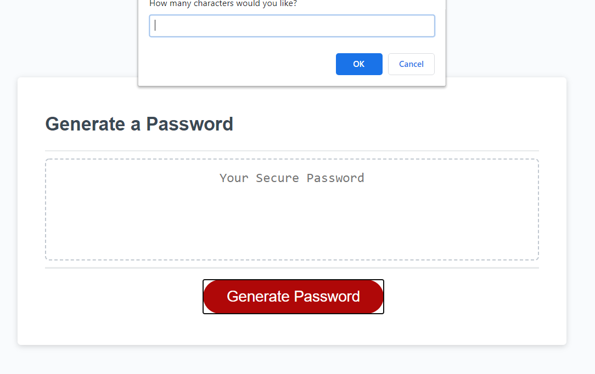
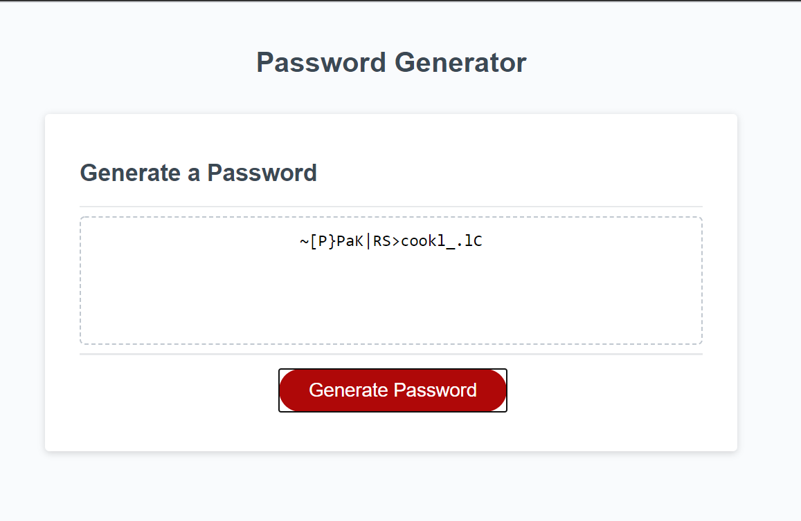

# Password-Generator
JavaScript: Password Generator

## Why I did this homework

The goal of this homework is to create a web application that will generate a random password with four choices of criteria. These are lowercase, uppercase, numeric, and/or special characters. The application must also be a responsive web application and have a clean user interface.

## What I learned

## Link to Github

https://github.com/Cloud126/Password-Generator

## Link to LIVE URL

https://cloud126.github.io/Password-Generator/

## Screenshot

## License

MIT License

Copyright (c) [2020] [Maurino Federico Hernandez]

Permission is hereby granted, free of charge, to any person obtaining a copycd
of this software and associated documentation files (the "Software"), to deal
in the Software without restriction, including without limitation the rights
to use, copy, modify, merge, publish, distribute, sublicense, and/or sell
copies of the Software, and to permit persons to whom the Software is
furnished to do so, subject to the following conditions:

The above copyright notice and this permission notice shall be included in all
copies or substantial portions of the Software.

THE SOFTWARE IS PROVIDED "AS IS", WITHOUT WARRANTY OF ANY KIND, EXPRESS OR
IMPLIED, INCLUDING BUT NOT LIMITED TO THE WARRANTIES OF MERCHANTABILITY,
FITNESS FOR A PARTICULAR PURPOSE AND NONINFRINGEMENT. IN NO EVENT SHALL THE
AUTHORS OR COPYRIGHT HOLDERS BE LIABLE FOR ANY CLAIM, DAMAGES OR OTHER
LIABILITY, WHETHER IN AN ACTION OF CONTRACT, TORT OR OTHERWISE, ARISING FROM,
OUT OF OR IN CONNECTION WITH THE SOFTWARE OR THE USE OR OTHER DEALINGS IN THE
SOFTWARE.

